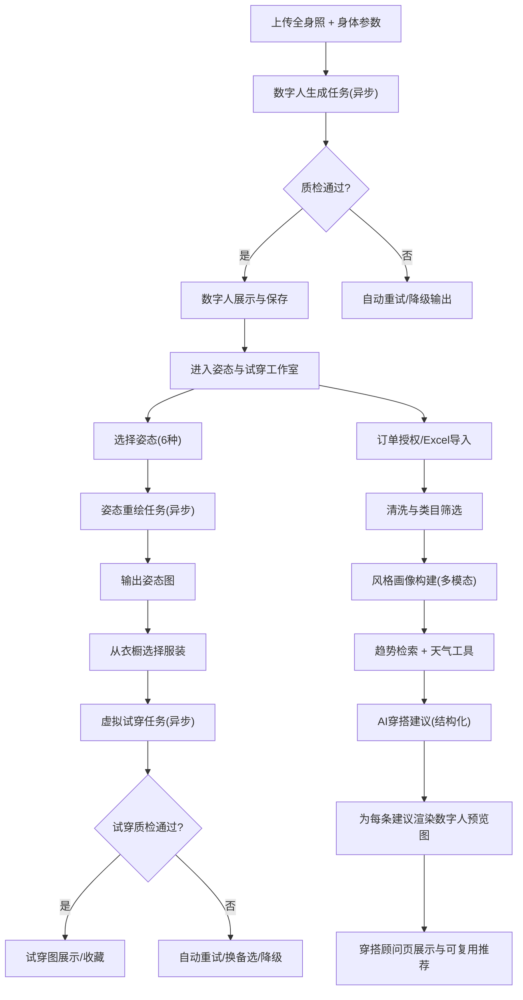

## 1. 产品概述
AI 智能试衣间：整合数字人生成、姿态控制、虚拟换装与电商数据驱动的穿搭推荐，为用户提供“定制数字人—调姿态—试穿—获得可视化搭配建议”的一站式体验。
- 面向人群：电商高频购买用户、注重穿搭效率与试错成本的用户、内容创作者（试穿展示）
- 核心价值：降低试穿与搭配决策成本；提升衣橱利用率与购买转化；沉淀可复用的风格画像资产

## 2. 核心功能

### 2.1 用户角色
| 角色 | 注册/登录方式 | 核心权限 |
|------|--------------|----------|
| 普通用户 | 手机/邮箱 + OAuth（淘宝/亚马逊可选） | 创建数字人、姿态切换、衣橱上传与试穿、生成穿搭建议 |
| 管理员（运营） | 后台账号 | 查看任务队列与失败原因、配置模型版本与阈值、管理趋势知识源 |

### 2.2 功能模块（页面级）
1. **工作台（/）**：入口引导、进度总览（数字人/衣橱/订单/建议）
2. **数字人定制（/avatar）**：上传全身照 + 身体参数表单 + 生成结果预览
3. **姿态与试穿（/studio）**：姿态库切换 + 骨架加载态 + 一键试穿 + 结果对比
4. **个人衣橱（/closet）**：按类目上传/筛选/收藏 + 单品详情
5. **订单与授权（/orders）**：OAuth 授权 + 历史订单同步 + Excel 导入与校验回执
6. **AI 穿搭顾问（/stylist）**：结构化搭配卡片 + 天气/场景解释 + 必带数字人预览图

### 2.3 页面明细
| 页面名称 | 模块名称 | 功能描述 |
|---------|----------|----------|
| 工作台 | 状态卡片 | 显示数字人是否已生成、当前姿态、衣橱数量、订单同步状态、建议生成按钮 |
| 数字人定制 | 图片上传 | 仅允许单张清晰正面免冠全身照；≤10MB；分辨率≥1080×1920；支持重新上传 |
| 数字人定制 | 身体参数表单 | 身高/体重/肩宽/三围可编辑；实时校验（身高120-220cm、体重30-200kg等） |
| 数字人定制 | 生成结果 | 写实数字人输出；支持放大查看与“设为当前数字人” |
| 姿态与试穿 | 姿态库面板 | 6种姿态缩略图（叉腰/垂立/背手/T台/坐姿/侧身）；一键切换 |
| 姿态与试穿 | 切换加载态 | 骨架线预览动画 + 进度展示；支持取消/重试 |
| 姿态与试穿 | 试穿流程 | 从衣橱选服装 → 一键试穿 → 进度条 → 输出预览图与收藏 |
| 个人衣橱 | 上传与分类 | 上衣/裤子/裙子/外套/配饰；单张≤8MB白底图；自动抠图与轮廓精修 |
| 订单与授权 | OAuth | 淘宝/亚马逊 OAuth2.0（PKCE）；token 加密存储；可撤销 |
| 订单与授权 | Excel 导入 | 模板下载；列级校验；返回行号错误原因；目标格式错误率≤1% |
| AI穿搭顾问 | 画像与建议 | 风格标签画像 + 场景/天气适配；建议必须绑定数字人试穿预览图 |

## 3. 核心流程
### 3.1 主用户路径（自然语言）
用户在数字人定制页上传照片并填写体型参数，生成写实数字人后进入工作室页，通过姿态库切换姿态并从衣橱选择单品进行试穿。用户可授权电商账号或导入订单，系统构建风格画像并结合天气与趋势生成结构化穿搭建议；每条建议均自动渲染在用户数字人上作为预览图展示。

### 3.2 流程图

## 4. 用户界面设计
### 4.1 设计风格
- 总体风格：ins 极简插画风 UI（留白、轻质感卡片、柔和渐变与细线图标）
- 关键约束：人物与试穿预览为写实输出，身份保持优先；UI与出图风格解耦
- 颜色：米白/浅灰为底色，强调色为深墨绿或煤黑；危险/错误用低饱和红
- 按钮：圆角胶囊按钮 + 轻阴影；关键动作（生成/试穿）使用高对比强调色
- 字体：标题用具设计感的中文展示字体（可替换），正文用易读的中文无衬线
- 动效：任务创建/切换姿态使用骨架线加载态；进度条与状态徽章强调可感知

### 4.2 页面设计概览
| 页面名称 | 模块名称 | UI元素 |
|---------|----------|--------|
| 工作台 | 状态卡片 | 大留白网格卡片、任务进度条、最近一次生成缩略图 |
| 数字人定制 | 表单与上传 | 左侧上传区（拖拽）+ 右侧参数表单；非法输入即时红线提示 |
| 姿态与试穿 | 姿态库 | 6宫格缩略图 + hover 高亮；切换时骨架线覆盖于数字人区域 |
| 个人衣橱 | 类目筛选 | 顶部类目 chips + 瀑布流卡片；收藏用心形小图标 |
| AI穿搭顾问 | 建议卡片 | 每条建议=预览图 + 三段理由（理由/场景/天气）+ 可一键试穿同款 |

### 4.3 响应式
桌面优先；移动端自适配：上传与预览区域上下排列；任务进度条固定在底部浮层便于感知。

## 5. 性能与验收指标（MVP硬指标）
- 数字人生成：端到端 P95 ≤ 8s；身份相似度达阈值；失败率 ≤ 1.5%
- 姿态切换：端到端 P95 ≤ 10s；骨骼关键点匹配 ≥ 95%；明显扭曲缺陷率 ≤ 1%
- 虚拟试穿：端到端 P95 ≤ 12s；边缘重合度 ≥ 92%；严重穿模/悬浮缺陷率 ≤ 2%
- 订单导入：格式错误率 ≤ 1%；清洗完成率 = 100%；服饰/鞋包筛选准确率 ≥ 98%
- 风格标签：匹配准确率 ≥ 90%（抽样标注集评估）

