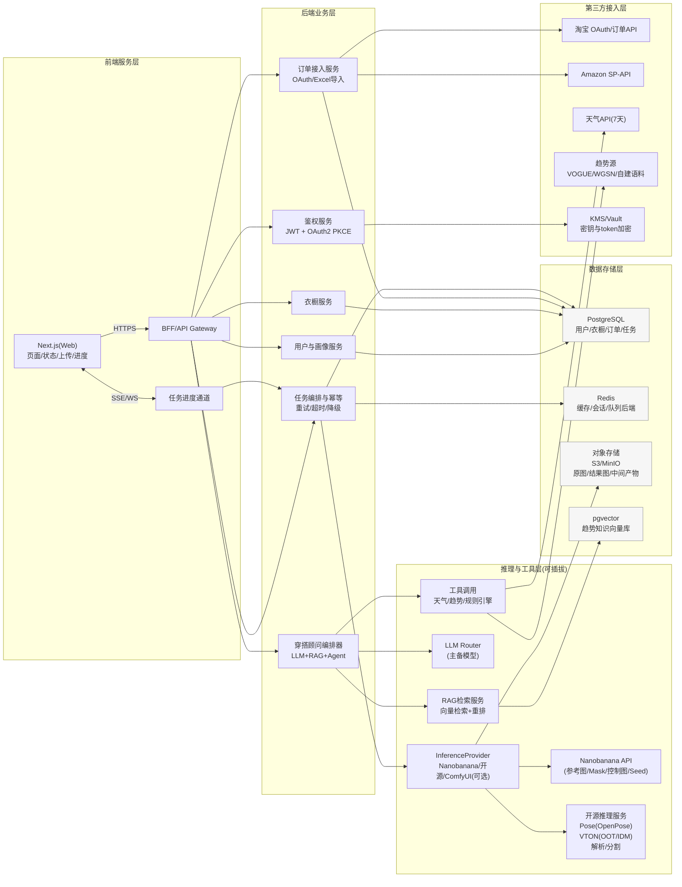
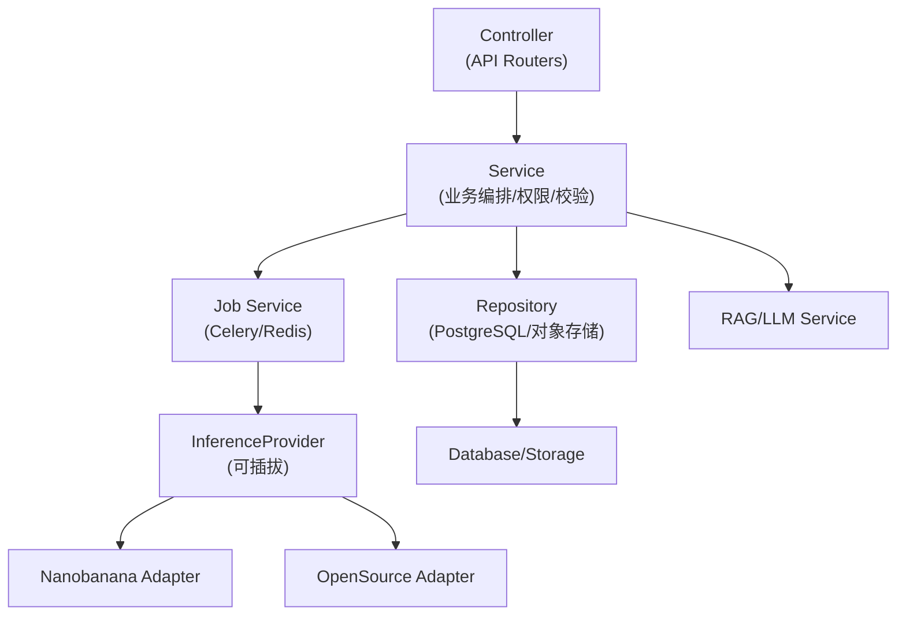
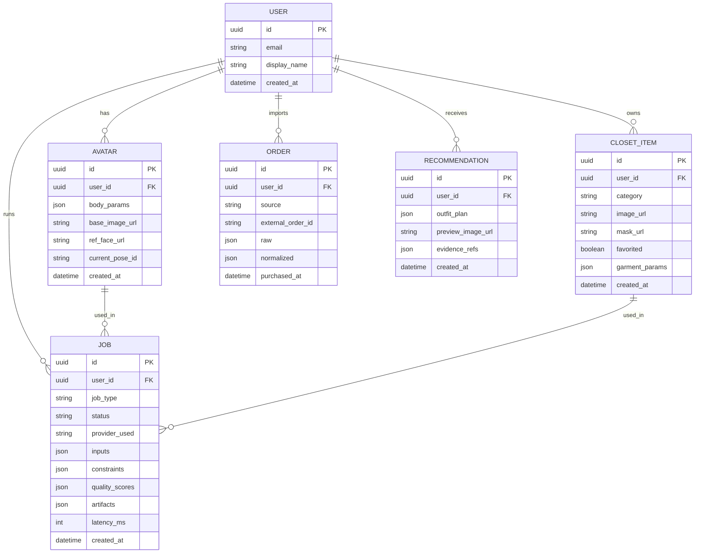

## 1. 架构设计


## 2. 技术选型说明
- 前端：Next.js + TypeScript + TailwindCSS；SSE（默认）/WebSocket（可选）用于任务进度
- BFF/API：FastAPI（Python）或 NestJS（Node）二选一；默认推荐 FastAPI（与推理生态更贴近）
- 异步任务：Celery + Redis（队列与重试），或后续演进到 Temporal（更强可观测）
- 数据库：PostgreSQL（含 pgvector 扩展用于向量检索）
- 对象存储：MinIO（本地/自建）或 S3（云端）
- 推理接入：统一 InferenceProvider 抽象；优先 Nanobanana 云端 API；姿态与换装保留开源强约束兜底
- 观测：OpenTelemetry Trace + 结构化日志；关键指标（P95耗时/失败率/质检通过率）

## 3. 路由定义
| 路由 | 用途 |
|------|------|
| / | 工作台：状态概览与入口 |
| /avatar | 数字人定制：上传与参数 |
| /studio | 姿态与试穿：姿态库 + 试穿 |
| /closet | 个人衣橱：上传/筛选/收藏 |
| /orders | 订单与授权：OAuth/Excel导入 |
| /stylist | AI穿搭顾问：建议列表与预览 |

## 4. API 定义（核心：任务化 + 可插拔推理）
### 4.1 数据类型（TypeScript）
```ts
export type JobType = "avatar_generate" | "pose_render" | "vton_tryon" | "outfit_render";

export type ProviderPreference = "nanobanana_first" | "open_source_first" | "comfyui_first";

export type JobStatus = "queued" | "running" | "succeeded" | "failed" | "canceled";

export interface BodyParams {
  heightCm: number;
  weightKg: number;
  shoulderWidthCm?: number;
  chestCm?: number;
  waistCm?: number;
  hipCm?: number;
}

export interface JobCreateRequest {
  jobType: JobType;
  providerPreference: ProviderPreference;
  inputs: Record<string, unknown>;
  constraints?: {
    identityLock?: boolean;
    poseLock?: boolean;
    garmentLock?: boolean;
    seed?: number;
    qualityLevel?: "standard" | "high";
    timeoutSec?: number;
  };
}

export interface QualityScores {
  idSimilarity?: number;
  poseMatch?: number;
  boundaryF1?: number;
  artifactScore?: number;
}

export interface JobResponse {
  jobId: string;
  status: JobStatus;
  stage?: string;
  progress?: number;
  artifacts?: Array<{ kind: "image" | "mask" | "json"; url: string; meta?: Record<string, unknown> }>;
  qualityScores?: QualityScores;
  error?: { code: string; message: string; detail?: Record<string, unknown> };
}
```

### 4.2 端点清单
| 方法 | 路径 | 说明 |
|------|------|------|
| POST | /v1/jobs | 创建任务（avatar/pose/vton/outfit） |
| GET | /v1/jobs/{jobId} | 查询任务状态、进度、产物、质检分 |
| POST | /v1/assets/upload-url | 获取直传URL（图片/Excel） |
| POST | /v1/avatar/profile | 保存身体参数与当前数字人引用 |
| POST | /v1/closet/items | 创建衣橱单品（类目/图片/收藏） |
| POST | /v1/orders/oauth/{provider}/start | 发起OAuth（PKCE） |
| POST | /v1/orders/import/excel | 导入Excel（返回行级错误） |
| POST | /v1/stylist/recommendations | 生成穿搭建议（异步） |

## 5. 服务端架构图（FastAPI示例）


## 6. 数据模型
### 6.1 ER 图


### 6.2 DDL（概要）
```sql
create table users (
  id uuid primary key,
  email text unique,
  display_name text,
  created_at timestamptz not null default now()
);

create table avatars (
  id uuid primary key,
  user_id uuid not null references users(id),
  body_params jsonb not null,
  base_image_url text not null,
  ref_face_url text,
  current_pose_id text,
  created_at timestamptz not null default now()
);

create table closet_items (
  id uuid primary key,
  user_id uuid not null references users(id),
  category text not null,
  image_url text not null,
  mask_url text,
  favorited boolean not null default false,
  garment_params jsonb,
  created_at timestamptz not null default now()
);

create table orders (
  id uuid primary key,
  user_id uuid not null references users(id),
  source text not null,
  external_order_id text,
  raw jsonb not null,
  normalized jsonb,
  purchased_at timestamptz,
  created_at timestamptz not null default now(),
  unique (source, external_order_id)
);

create table jobs (
  id uuid primary key,
  user_id uuid not null references users(id),
  job_type text not null,
  status text not null,
  provider_used text,
  inputs jsonb not null,
  constraints jsonb,
  quality_scores jsonb,
  artifacts jsonb,
  latency_ms int,
  created_at timestamptz not null default now()
);
create index jobs_user_created_idx on jobs(user_id, created_at desc);
create index closet_items_user_category_idx on closet_items(user_id, category);
```

## 7. Nanobanana-first 推理策略（定稿）
### 7.1 能力开关（你已确认支持）
- 参考人脸/参考图：支持（用于 identityLock）
- Mask 编辑：支持（用于局部修复/增强而不改轮廓）
- 控制图输入：支持（用于 OpenPose/边缘/深度等）
- 可重复参数：支持（seed/strength/guidance）
- 限流与超时：按供应商策略配置（后端实现自适应退避与降级）

### 7.2 任务质量门控（默认阈值，后续用标注集校准）
- avatar_generate：idSimilarity ≥ 0.75；artifactScore ≥ 0.6；不通过→最多2次重试→仍失败则降级返回最近一次可用头像
- pose_render：poseMatch ≥ 0.95 且 idSimilarity ≥ 0.75；不通过→切到开源 OpenPose 强约束→必要时再用 nanobanana 做细节增强（mask 约束）
- vton_tryon：boundaryF1 ≥ 0.92 且无穿模规则命中；不通过→同模型重试1次→切换备选VTON模型→仍失败则降级占位预览并后台补算

